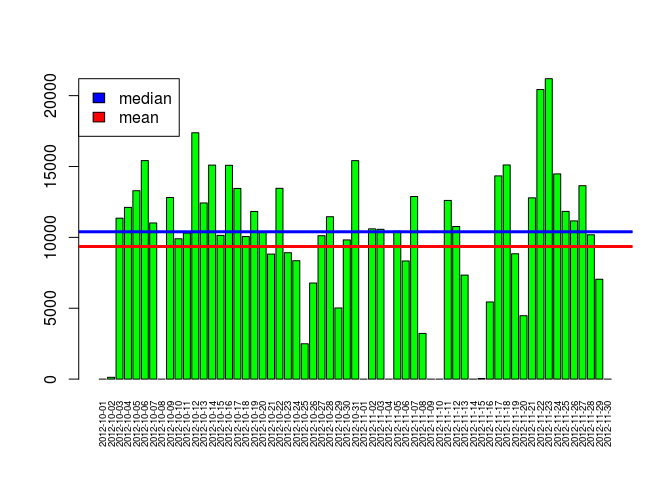
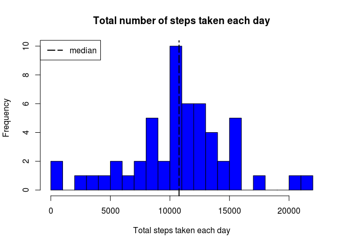
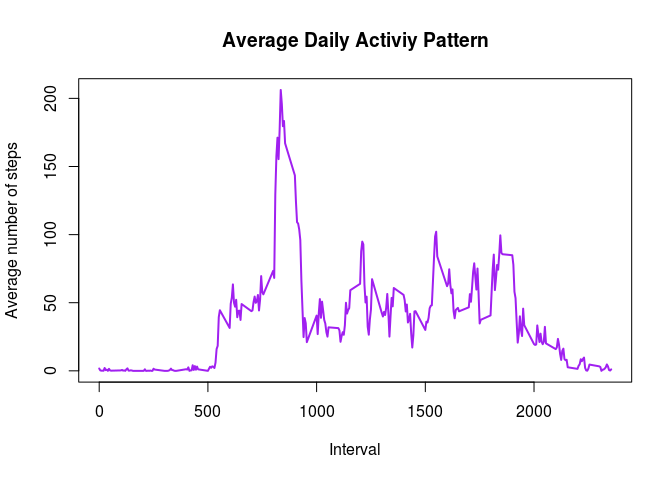
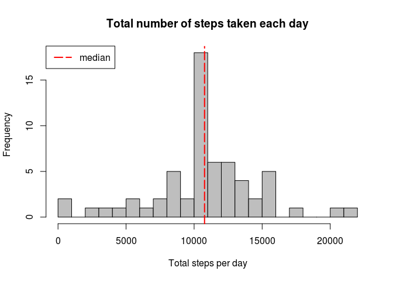
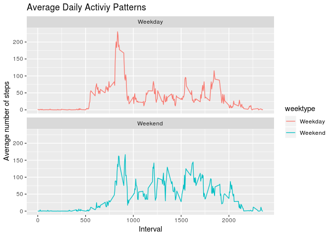

## Loading and preprocessing the data

```r
unzip("activity.zip")
active_data <- read.csv("activity.csv", header = TRUE, stringsAsFactors=FALSE)
active_data$date <-  as.POSIXct(active_data$date, format="%Y-%m-%d")
dayofweek <- weekdays(active_data$date)
active_data <- cbind(active_data, dayofweek)
summary(active_data)
```

```
##      steps             date                        interval     
##  Min.   :  0.00   Min.   :2012-10-01 00:00:00   Min.   :   0.0  
##  1st Qu.:  0.00   1st Qu.:2012-10-16 00:00:00   1st Qu.: 588.8  
##  Median :  0.00   Median :2012-10-31 00:00:00   Median :1177.5  
##  Mean   : 37.38   Mean   :2012-10-31 00:25:34   Mean   :1177.5  
##  3rd Qu.: 12.00   3rd Qu.:2012-11-15 00:00:00   3rd Qu.:1766.2  
##  Max.   :806.00   Max.   :2012-11-30 00:00:00   Max.   :2355.0  
##  NA's   :2304                                                   
##      dayofweek   
##  Friday   :2592  
##  Monday   :2592  
##  Saturday :2304  
##  Sunday   :2304  
##  Thursday :2592  
##  Tuesday  :2592  
##  Wednesday:2592
```

```r
head(active_data)
```

```
##   steps       date interval dayofweek
## 1    NA 2012-10-01        0    Monday
## 2    NA 2012-10-01        5    Monday
## 3    NA 2012-10-01       10    Monday
## 4    NA 2012-10-01       15    Monday
## 5    NA 2012-10-01       20    Monday
## 6    NA 2012-10-01       25    Monday
```


## What is mean total number of steps taken per day?

### Calculate the number of steps per day

```r
all_steps <- active_data %>% group_by(date) %>% summarise (daily_steps = sum(steps,na.rm=TRUE))
head(all_steps)
```

```
## # A tibble: 6 x 2
##   date                daily_steps
##   <dttm>                    <int>
## 1 2012-10-01 00:00:00           0
## 2 2012-10-02 00:00:00         126
## 3 2012-10-03 00:00:00       11352
## 4 2012-10-04 00:00:00       12116
## 5 2012-10-05 00:00:00       13294
## 6 2012-10-06 00:00:00       15420
```

### Plot number of steps per day

```r
barplot(height = all_steps$daily_steps, names.arg=all_steps$date, cex.names=0.60, las=3, col = "green")
steps_median <- median(all_steps$daily_steps, na.rm = TRUE)
steps_mean <- round(mean(all_steps$daily_steps, na.rm = TRUE),digits = 0)
abline(h=steps_median,lwd=3, col="blue")
abline(h=steps_mean,lwd=3, col="red")
legend("topleft", c("median", "mean"), fill = c("blue", "red"))
```

<!-- -->

### Histogram of the total number of steps taken each day
#### (Removed all days with no activity)

```r
all_steps <- filter(all_steps, all_steps$daily_steps > 0)
hist(all_steps$daily_steps, breaks = nrow(all_steps)/3,  main = "Total number of steps taken each day", 
     xlab = "Total steps taken each day", col = "blue")
abline(v=median(all_steps$daily_steps),lty=5, lwd=2, col="black")
legend(legend="median","topleft",lty=5,lwd=2)
```

<!-- -->

### Calculate and report the mean and median of the total number of steps taken per day

```r
steps_mean <- as.integer(mean(all_steps$daily_steps, na.rm = TRUE))
steps_median <- as.integer(median(all_steps$daily_steps, na.rm = TRUE))
```
The average (mean) number of steps taken per day is 10766 and the median number of steps per day is 10765.  


## What is the average daily activity pattern?
### Time Series plot showing daily activity pattern

```r
daily_activity <- active_data %>% group_by(interval) %>% summarise(daily_average=mean(steps, na.rm = TRUE))
plot(daily_activity$interval, daily_activity$daily_average, type = "l", col="purple", lwd = 2, xlab="Interval",
     ylab="Average number of steps", main="Average Daily Activiy Pattern")
```

<!-- -->

### Which 5-minute interval, on average across all the days in the dataset, contains the maximum number of steps?

```r
max_interval <- filter(daily_activity,daily_average==max(daily_average))
```

The interval containing the max value is "835".  The value for that interval is "206.17" steps. 


## Imputing missing values
### Calculate and report the total number of missing values in the dataset (i.e. the total number of rows with NAs)

```r
missingvalues <- sum(is.na(active_data$steps))
```
The total number of missing values in the dataset is 2304.

### Devise a strategy for filling in all of the missing values in the dataset.
Create average template for all interval of the day.  Use the template to fill in any blanks for missing values.

```r
avg_temp <-  daily_activity$daily_average[match(active_data$interval, daily_activity$interval)]
active_data_imputed <- transform(active_data, steps = ifelse(is.na(active_data$steps), 
                                                             yes = avg_temp, no = active_data$steps))
imputed_total_steps <- active_data_imputed %>% group_by(date) %>% summarise (daily_steps = sum(steps))
```

### Make a histogram of the total number of steps taken each day

```r
hist(imputed_total_steps$daily_steps, col = "gray", xlab = "Total steps per day", 
     main = "Total number of steps taken each day", breaks = nrow(imputed_total_steps)/3)
abline(v=median(imputed_total_steps$daily_steps),lty=5, lwd=2, col="red")
legend(legend="median","topleft",lty=5,lwd=2, col = "red")
```

<!-- -->

### Calculate the mean and median total number of steps taken per day.

```r
mean(imputed_total_steps$daily_steps)
```

```
## [1] 10766.19
```

```r
median(imputed_total_steps$daily_steps)
```

```
## [1] 10766.19
```

Imputing missing values on the  missing 2304 entries did not change the mean but it did raise the median to equal the mean.  

## Are there differences in activity patterns between weekdays and weekends?
### Create a new factor variable in the dataset with two levels - "weekday" and "weekend"

```r
active_data_imputed$weektype <- sapply(active_data_imputed$date, function(x) {
        if (weekdays(x) == "Saturday" | weekdays(x) =="Sunday") 
                {y <- "Weekend"} else 
                {y <- "Weekday"}
                y
        })
table(active_data_imputed$weektype)
```

```
## 
## Weekday Weekend 
##   12960    4608
```

### Make a panel plot containing a time series plot

```r
daily_active_data_imputed <- aggregate(steps~interval + weektype, active_data_imputed, mean)
ggplot(data = daily_active_data_imputed, aes(x =interval, y = steps, col= weektype))  + 
  geom_line() + 
  labs(x="Interval", y ="Average number of steps", title="Average Daily Activiy Patterns") +
  facet_wrap(~weektype, ncol = 1, nrow = 2)
```

<!-- -->
